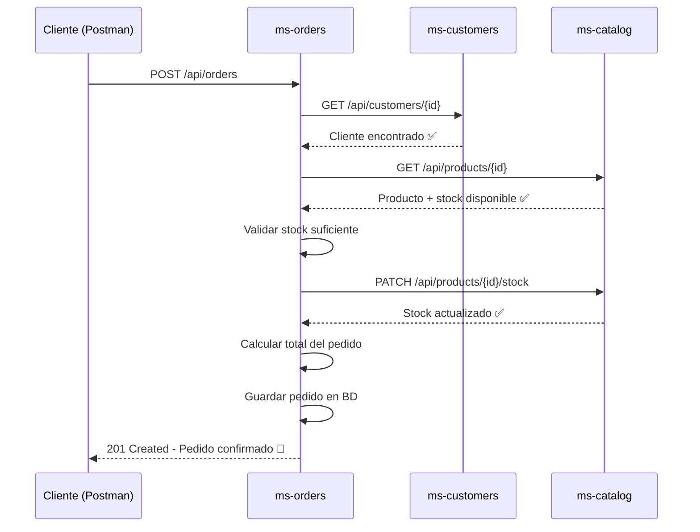

<div align="center">

# 🛒 OrderFlow — Sistema de Pedidos con Microservicios

### Plataforma de e-commerce construida con Spring Boot, Spring Cloud OpenFeign y arquitectura de microservicios

[](https://www.oracle.com/java/)
[](https://spring.io/projects/spring-boot)
[](https://spring.io/projects/spring-cloud-openfeign)
[](https://www.mysql.com/)
[](https://www.postgresql.org/)
[](https://www.docker.com/)
[](https://maven.apache.org/)
[](#-licencia)

</div>

---

## 📖 Descripción del proyecto

**OrderFlow** es un sistema de gestión de pedidos basado en una **arquitectura de microservicios** desarrollada con **Spring Boot**. El proyecto simula un flujo real de e-commerce, donde distintos servicios independientes se comunican entre sí mediante **Spring Cloud OpenFeign** para validar clientes, verificar stock de productos y generar pedidos de forma consistente y desacoplada.

Cada microservicio cuenta con su propia base de datos (siguiendo el patrón *Database per Service*), su propia lógica de negocio y puede desplegarse, escalarse y mantenerse de forma independiente. El proyecto está completamente **dockerizado**, lo que permite levantar todo el ecosistema con un solo comando.

> 💡 Este proyecto fue diseñado como pieza de portafolio para demostrar buenas prácticas en el diseño de microservicios con Java: separación de responsabilidades, comunicación entre servicios, manejo de transacciones de negocio y persistencia poliglota.

---

## 🧰 Tecnologías utilizadas

| Categoría | Tecnología |
|---|---|
| **Lenguaje** |  |
| **Framework** |  |
| **Persistencia** |  |
| **API REST** |  |
| **Comunicación entre servicios** |  |
| **Base de datos** |   |
| **Contenedores** |   |
| **Gestión de dependencias** |  |
| **Productividad** |  |
| **Pruebas de API** |  |

---

## 🏗️ Arquitectura del proyecto

El sistema está compuesto por **tres microservicios independientes**, cada uno con su propia base de datos, que se comunican entre sí mediante peticiones HTTP usando **OpenFeign**.

```
┌──────────────────────┐        ┌──────────────────────┐
│   ms-catalog (8081)   │        │  ms-customers (8082)  │
│   📦 Productos/Stock   │        │   👤 Clientes          │
│   MySQL                │        │   PostgreSQL           │
└───────────▲────────────┘        └───────────▲────────────┘
            │                                  │
            │  Feign Client (HTTP REST)        │  Feign Client (HTTP REST)
            │                                  │
            └────────────────┬─────────────────┘
                              │
                  ┌───────────────────────┐
                  │   ms-orders (8083)     │
                  │   🧾 Pedidos            │
                  │   PostgreSQL            │
                  │                         │
                  │  - Valida cliente       │
                  │  - Valida producto      │
                  │  - Valida stock         │
                  │  - Descuenta stock      │
                  │  - Calcula total        │
                  │  - Guarda el pedido     │
                  └───────────────────────┘
```

**Principios de diseño aplicados:**

- 🔹 **Database per Service**: cada microservicio gestiona su propia base de datos, evitando acoplamiento a nivel de persistencia.
- 🔹 **Comunicación síncrona vía REST/Feign**: `ms-orders` actúa como orquestador, consultando a `ms-catalog` y `ms-customers` antes de confirmar un pedido.
- 🔹 **Independencia de despliegue**: cada servicio puede construirse, desplegarse y escalarse de forma aislada.
- 🔹 **Contenerización completa**: todo el stack (servicios + bases de datos) se levanta con Docker Compose.

---

## 📁 Estructura de carpetas

```
order-system/
├── docker-compose.yml
├── README.md
│
├── ms-catalog/
│   ├── src/
│   │   └── main/
│   │       ├── java/com/orderflow/catalog/
│   │       │   ├── controller/
│   │       │   │   └── ProductController.java
│   │       │   ├── service/
│   │       │   │   ├── ProductService.java
│   │       │   │   └── impl/ProductServiceImpl.java
│   │       │   ├── repository/
│   │       │   │   └── ProductRepository.java
│   │       │   ├── model/
│   │       │   │   └── Product.java
│   │       │   ├── dto/
│   │       │   │   ├── ProductRequestDTO.java
│   │       │   │   └── ProductResponseDTO.java
│   │       │   ├── exception/
│   │       │   │   └── ProductNotFoundException.java
│   │       │   └── CatalogApplication.java
│   │       └── resources/
│   │           └── application.yml
│   ├── Dockerfile
│   └── pom.xml
│
├── ms-customers/
│   ├── src/
│   │   └── main/
│   │       ├── java/com/orderflow/customers/
│   │       │   ├── controller/
│   │       │   │   └── CustomerController.java
│   │       │   ├── service/
│   │       │   │   ├── CustomerService.java
│   │       │   │   └── impl/CustomerServiceImpl.java
│   │       │   ├── repository/
│   │       │   │   └── CustomerRepository.java
│   │       │   ├── model/
│   │       │   │   └── Customer.java
│   │       │   ├── dto/
│   │       │   │   ├── CustomerRequestDTO.java
│   │       │   │   └── CustomerResponseDTO.java
│   │       │   ├── exception/
│   │       │   │   └── CustomerNotFoundException.java
│   │       │   └── CustomersApplication.java
│   │       └── resources/
│   │           └── application.yml
│   ├── Dockerfile
│   └── pom.xml
│
└── ms-orders/
    ├── src/
    │   └── main/
    │       ├── java/com/orderflow/orders/
    │       │   ├── controller/
    │       │   │   └── OrderController.java
    │       │   ├── service/
    │       │   │   ├── OrderService.java
    │       │   │   └── impl/OrderServiceImpl.java
    │       │   ├── repository/
    │       │   │   └── OrderRepository.java
    │       │   ├── model/
    │       │   │   ├── Order.java
    │       │   │   └── OrderItem.java
    │       │   ├── dto/
    │       │   │   ├── OrderRequestDTO.java
    │       │   │   └── OrderResponseDTO.java
    │       │   ├── client/
    │       │   │   ├── CatalogClient.java
    │       │   │   └── CustomerClient.java
    │       │   ├── exception/
    │       │   │   ├── InsufficientStockException.java
    │       │   │   └── OrderProcessingException.java
    │       │   └── OrdersApplication.java
    │       └── resources/
    │           └── application.yml
    ├── Dockerfile
    └── pom.xml
```

---

## 🔍 Explicación de cada microservicio

### 📦 ms-catalog — Microservicio de Catálogo

Responsable de la gestión de productos y control de inventario.

- CRUD completo de productos (crear, listar, consultar, actualizar, eliminar).
- Persistencia en **MySQL**.
- Expone un endpoint interno para **descontar stock**, consumido por `ms-orders` mediante Feign.
- Valida que no se pueda descontar más stock del disponible.

### 👤 ms-customers — Microservicio de Clientes

Responsable de la administración de la información de los clientes.

- CRUD completo de clientes.
- Persistencia en **PostgreSQL**.
- Expone un endpoint de consulta por ID, utilizado por `ms-orders` para validar la existencia del cliente antes de generar un pedido.

### 🧾 ms-orders — Microservicio de Órdenes

Es el **orquestador del flujo de negocio**. Antes de registrar un pedido, ejecuta una serie de validaciones contra los demás microservicios:

1. Verifica que el **cliente** exista (vía `ms-customers`).
2. Verifica que el **producto** exista (vía `ms-catalog`).
3. Verifica que haya **stock suficiente**.
4. **Descuenta el stock** automáticamente en `ms-catalog`.
5. **Calcula el valor total** del pedido (precio unitario × cantidad).
6. **Persiste el pedido** en su base de datos **PostgreSQL**.

Toda la comunicación con los otros microservicios se realiza mediante **clientes Feign declarativos**, lo que simplifica las llamadas HTTP a interfaces Java con anotaciones.

---

## 🔄 Flujo de funcionamiento del sistema



**Resumen del flujo:**

1. El cliente envía una petición `POST` a `ms-orders` con el ID del cliente y los productos deseados.
2. `ms-orders` consulta a `ms-customers` para validar que el cliente exista.
3. `ms-orders` consulta a `ms-catalog` para validar que el producto exista y tenga stock suficiente.
4. Si todas las validaciones son exitosas, se descuenta el stock en `ms-catalog`.
5. `ms-orders` calcula el total del pedido y lo persiste en su base de datos.
6. Se retorna al cliente la confirmación del pedido con su detalle.

---

## 🐳 Cómo ejecutar el proyecto con Docker Compose

### Requisitos previos

- [Docker](https://www.docker.com/products/docker-desktop/) y Docker Compose instalados.
- Java 21 (opcional, solo si deseas compilar manualmente).
- Maven (opcional, solo si deseas compilar manualmente).

### Pasos

**1. Clonar el repositorio**

```bash
git clone https://github.com/tu-usuario/order-system.git
cd order-system
```

**2. Compilar los microservicios (genera los .jar)**

```bash
cd ms-catalog && mvn clean package -DskipTests && cd ..
cd ms-customers && mvn clean package -DskipTests && cd ..
cd ms-orders && mvn clean package -DskipTests && cd ..
```

**3. Levantar todo el stack con Docker Compose**

```bash
docker-compose up --build
```

**4. Verificar que los contenedores estén corriendo**

```bash
docker ps
```

Deberías ver los contenedores de los tres microservicios junto a sus bases de datos MySQL y PostgreSQL.

**5. Servicios disponibles**

| Servicio | URL base | Puerto |
|---|---|---|
| ms-catalog | `http://localhost:8081` | 8081 |
| ms-customers | `http://localhost:8082` | 8082 |
| ms-orders | `http://localhost:8083` | 8083 |

**6. Detener el entorno**

```bash
docker-compose down
```

Para eliminar también los volúmenes de las bases de datos:

```bash
docker-compose down -v
```

---

## 📬 Cómo probar la API con Postman

1. Abre **Postman** y crea una nueva **Collection** llamada `OrderFlow`.
2. Crea una carpeta por cada microservicio: `Catalog`, `Customers` y `Orders`.
3. Configura una variable de entorno por servicio (o usa las URLs base de la tabla anterior):
   - `catalog_url` → `http://localhost:8081`
   - `customers_url` → `http://localhost:8082`
   - `orders_url` → `http://localhost:8083`
4. Sigue este flujo recomendado de pruebas:
   1. Crear un cliente en `ms-customers`.
   2. Crear un producto con stock en `ms-catalog`.
   3. Crear un pedido en `ms-orders` usando el ID del cliente y del producto creados.
   4. Consultar el pedido generado y verificar que el stock del producto haya disminuido.

> 📝 *(Opcional)* Puedes exportar tu colección de Postman como `OrderFlow.postman_collection.json` y agregarla a la raíz del repositorio para que cualquiera pueda importarla directamente.

---

## 🌐 Endpoints principales

### 📦 ms-catalog (`/api/products`)

| Método | Endpoint | Descripción |
|---|---|---|
| `POST` | `/api/products` | Crea un nuevo producto |
| `GET` | `/api/products` | Lista todos los productos |
| `GET` | `/api/products/{id}` | Obtiene un producto por ID |
| `PUT` | `/api/products/{id}` | Actualiza un producto |
| `DELETE` | `/api/products/{id}` | Elimina un producto |
| `PATCH` | `/api/products/{id}/stock` | Descuenta stock (uso interno vía Feign) |

### 👤 ms-customers (`/api/customers`)

| Método | Endpoint | Descripción |
|---|---|---|
| `POST` | `/api/customers` | Crea un nuevo cliente |
| `GET` | `/api/customers` | Lista todos los clientes |
| `GET` | `/api/customers/{id}` | Obtiene un cliente por ID |
| `PUT` | `/api/customers/{id}` | Actualiza un cliente |
| `DELETE` | `/api/customers/{id}` | Elimina un cliente |

### 🧾 ms-orders (`/api/orders`)

| Método | Endpoint | Descripción |
|---|---|---|
| `POST` | `/api/orders` | Crea un nuevo pedido (con todas las validaciones) |
| `GET` | `/api/orders` | Lista todos los pedidos |
| `GET` | `/api/orders/{id}` | Obtiene el detalle de un pedido por ID |
| `GET` | `/api/orders/customer/{customerId}` | Lista los pedidos de un cliente específico |

---

## 📦 Ejemplos de peticiones JSON

### Crear un cliente — `POST /api/customers`

```json
{
  "fullName": "Laura Gómez",
  "email": "laura.gomez@example.com",
  "phone": "+57 300 123 4567",
  "address": "Calle 45 #12-30, Bogotá"
}
```

### Crear un producto — `POST /api/products`

```json
{
  "name": "Teclado Mecánico RGB",
  "description": "Teclado mecánico con switches azules e iluminación RGB",
  "price": 189900.00,
  "stock": 50
}
```

### Crear un pedido — `POST /api/orders`

```json
{
  "customerId": 1,
  "items": [
    {
      "productId": 3,
      "quantity": 2
    },
    {
      "productId": 7,
      "quantity": 1
    }
  ]
}
```

### Respuesta exitosa — `201 Created`

```json
{
  "orderId": 15,
  "customer": {
    "id": 1,
    "fullName": "Laura Gómez"
  },
  "items": [
    {
      "productId": 3,
      "productName": "Teclado Mecánico RGB",
      "quantity": 2,
      "unitPrice": 189900.00,
      "subtotal": 379800.00
    },
    {
      "productId": 7,
      "productName": "Mouse Inalámbrico",
      "quantity": 1,
      "unitPrice": 89900.00,
      "subtotal": 89900.00
    }
  ],
  "totalAmount": 469700.00,
  "createdAt": "2026-06-30T10:15:00"
}
```

### Respuesta de error — stock insuficiente — `409 Conflict`

```json
{
  "timestamp": "2026-06-30T10:16:32",
  "status": 409,
  "error": "Conflict",
  "message": "Stock insuficiente para el producto con ID 3",
  "path": "/api/orders"
}
```

---

## 🖼️ Capturas de pantalla

> Agrega aquí las capturas de pantalla de tu proyecto en funcionamiento.

**📦 Catálogo de productos (Postman)**

`(Inserta aquí la captura de pantalla)`

**👤 Gestión de clientes (Postman)**

`(Inserta aquí la captura de pantalla)`

**🧾 Creación de un pedido (Postman)**

`(Inserta aquí la captura de pantalla)`

**🐳 Contenedores corriendo en Docker**

`(Inserta aquí la captura de pantalla)`

---

## ✅ Características implementadas

- [x] CRUD completo de productos con control de stock.
- [x] CRUD completo de clientes.
- [x] Creación de pedidos con validaciones de negocio en cadena.
- [x] Comunicación entre microservicios mediante Spring Cloud OpenFeign.
- [x] Descuento automático de stock al generar un pedido.
- [x] Cálculo automático del valor total del pedido.
- [x] Persistencia poliglota (MySQL + PostgreSQL).
- [x] Manejo de excepciones personalizadas (cliente no encontrado, producto no encontrado, stock insuficiente).
- [x] Entorno completamente dockerizado con Docker Compose.
- [x] Colección de Postman para pruebas manuales de la API.

## 🚀 Posibles mejoras futuras

- [ ] Implementar **API Gateway** (Spring Cloud Gateway) como punto único de entrada.
- [ ] Agregar **Eureka Server** para descubrimiento dinámico de servicios.
- [ ] Incorporar **Resilience4j** (Circuit Breaker / Retry) para tolerancia a fallos en las llamadas Feign.
- [ ] Migrar la comunicación síncrona a **eventos asíncronos** con Kafka o RabbitMQ.
- [ ] Añadir **autenticación y autorización** con Spring Security + JWT.
- [ ] Implementar **pruebas unitarias e integración** con JUnit 5 y Testcontainers.
- [ ] Agregar **documentación interactiva** con Swagger / OpenAPI.
- [ ] Configurar **observabilidad** (logs centralizados, métricas con Prometheus/Grafana).
- [ ] Despliegue en la nube (AWS / Azure / GCP) con CI/CD.

---

## 👨‍💻 Autor

**Tu Nombre**
Desarrollador Backend Java | Spring Boot | Microservicios

[](https://github.com/tu-usuario)
[](https://linkedin.com/in/tu-usuario)
[](mailto:tu-correo@example.com)

---

## 📄 Licencia

Este proyecto está distribuido bajo la licencia **MIT**. Eres libre de usarlo, modificarlo y distribuirlo, siempre que se mantenga el aviso de copyright original.

```
MIT License

Copyright (c) 2026 Tu Nombre

Por la presente se concede permiso, libre de cargos, a cualquier persona que obtenga una
copia de este software y de los archivos de documentación asociados, para utilizar el
software sin restricción, incluyendo sin limitación los derechos a usar, copiar, modificar,
fusionar, publicar, distribuir, sublicenciar y/o vender copias del software.

El software se proporciona "tal cual", sin garantía de ningún tipo.
```

---

<div align="center">

⭐ Si este proyecto te resultó útil, ¡no olvides darle una estrella en GitHub! ⭐

</div>
